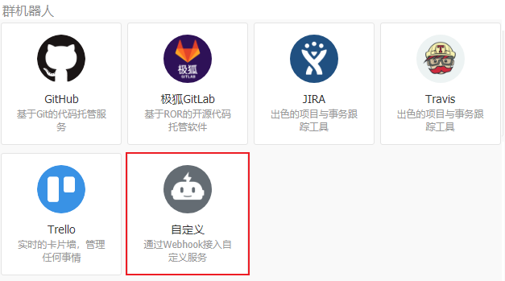
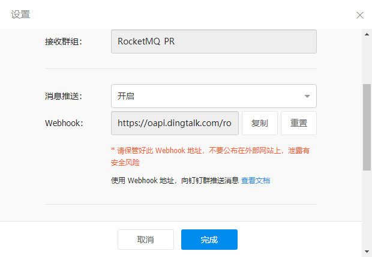
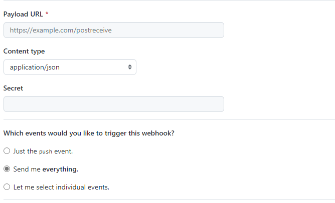
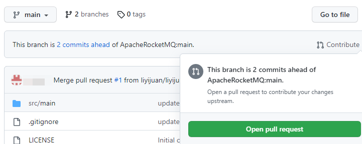
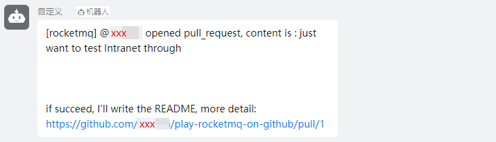
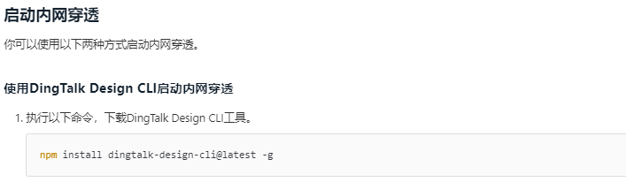

# play-rocketmq-on-github
玩转RocketMQ社区

① fork 项目到个人 GitHub 远程仓库，通过 git 下载代码到本地

 [ApacheRocketMQ/play-rocketmq-on-github](https://github.com/ApacheRocketMQ/play-rocketmq-on-github) 

② 分析项目结构，根据个人情况进行适当配置

1. pom 文件添加 

```pom.xml
<dependency>
    <groupId>org.springframework.boot</groupId>
    <artifactId>spring-boot-configuration-processor</artifactId>
    <optional>true</optional>
</dependency>
```

2. 配置 application.properties 文件

```properties
server.port=9877
rocketmq.producerGroup=github_event_producer
rocketmq.topic=github_event_topic
rocketmq.namesrv=xxx.xxx.xxx.xxx:9876
rocketmq.consumerGroup=github_event_consumer
dingding.webhookUrl=https://oapi.dingtalk.com/robot/send?access_token=xxxxx
dingding.keyword=RocketMQ
```

说明：设置 dingding* 需要先创建钉钉群，自定义智能机器人

群设置 ```>``` 智能群助手



安全设置 ```>``` 自定义关键词 【将该字段填入 dingding.keyword】



设置完成生成的 Webhook 填入 dingding.webhookUrl

③ 编译 play-rocketmq-on-github 

```shell
mvn clean package
```

说明：若是本地编译打包，远程运行 jar 文件，需要保证 jdk 版本一致

④ 设置 GitHub-Webhooks

Settings ```>``` Webhooks ```>``` Add webhook



⑤ 启动 RocketMQ

 [RocketMQ一站式入门使用 - 云起实验室](https://developer.aliyun.com/adc/scenario/47efb0ab5a9741448e7a3e999336022e?spm=a2c6h.27198282.J_1475422600.1.61c573e8ieEr1l) 

⑥ 启动项目

```shell
java -jar wanwan-rocketmq-0.0.1-SNAPSHOT.jar # ./target/
```

⑦ 提交 PR 测试



查看钉群推送信息



说明：设置 Settings 是在自己 fork 的仓库，因此智能机器人上反馈的是 fork repository 仓库上提交的 issue 和 PR 信息。


补充说明：设置 GitHub-Payload URL

1. 项目逻辑：

GitHub hook ```>``` payload url ```>``` ```play-rocketmq-on-github``` ```>``` rocketmq ```>``` 钉钉 hook

```java
@RestController
public class IndexController {
    @Autowired
    private RocketMQConfig rocketMQConfig;

    @Autowired
    private DefaultMQProducer producer;

    @RequestMapping(value = "/payload", method = RequestMethod.POST)
    public String get(@RequestBody String eventString, @RequestHeader Map<String, String> headers) throws MQBrokerException, RemotingException, InterruptedException, MQClientException {
        // 1.创建 Message 对象
        Message message = new Message();
        message.setTopic(rocketMQConfig.getTopic());
        // 2.获取 http 消息体封装到 message
        message.setBody(eventString.getBytes(StandardCharsets.UTF_8));
        // 3.消息传入 RocketMQ 处理
        SendResult result = producer.send(message);
        return result.toString();
    }
}
```

2. 公网IP：

@RequestMapping 将请求映射到 ip:port/payload

也就是 GitHub 将web页面消息发送到 ip:port/payload

此处的 ip 即为运行 ```play-rocketmq-on-github``` 的 ip，port 在 application.properties 中设置为

```properties
server.port=9877
```

接下来需要考虑：ip，需要能在互联网上通信，也即公网 IP

若是使用云起实验室环境测试，GitHub-Payload URL 可设置为 ```公网ip:9877/payload```

若是使用本地虚拟机测试，可以借助 ```ngrok```，进行内网穿透，钉钉上也有这个服务



3. ngrok 内网穿透

  [About webhooks - GitHub Docs](https://docs.github.com/cn/developers/webhooks-and-events/webhooks/about-webhooks) 有关于 webhook 的详细说明

下载 ngrok 到运行 ```play-rocketmq-on-github``` 的环境，为 ```9877``` 开启 http 通道

```shell
ngrok http 9877
```

运行后得到类似：

```shell
Forwarding  https://xxxxxx.ap.ngrok.io -> http://localhost:9877
```

设置 payloadUrl ```https://xxxxxx.ap.ngrok.io/payload```

ngrok 连接可能会断开，再次申请后，上述的 .ngrok.io 会变更，需要重新设置。


